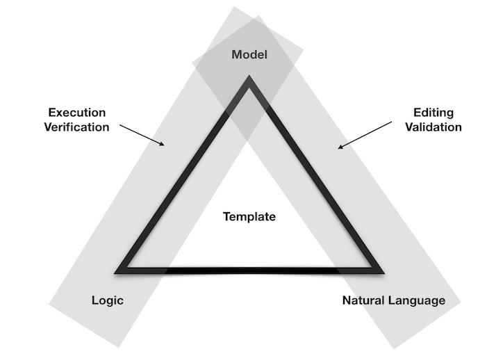

# Template 

A template is composed of three elements: 

- Template Grammar, the natural language text for the template 
- Template Model, the data model that backs the template 
- Logic, the executable business logic for the template



When combined these three elements allow templates to be edited, analyzed, queried and executed.

A complete sample template is available here:
https://github.com/accordproject/cicero-template-library/tree/master/latedeliveryandpenalty

# Template Grammar 

The template grammar for a template captures the natural language structure of the template. It is
UTF-8 text with markup to introduce named variables.

Here is a simple template grammar:

```
   Late Delivery and Penalty. In case of delayed delivery[{" except for Force
   Majeure cases,":? forceMajeure}] the Seller shall pay to the Buyer for every
   [{penaltyDuration}] of delay penalty amounting to [{penaltyPercentage}]% of
   the total value of the Equipment whose delivery has been delayed. Any
   fractional part of a [{fractionalPart}] is to be considered a full
   [{fractionalPart}]. The total amount of penalty shall not however, exceed
   [{capPercentage}]% of the total value of the Equipment involved in late
   delivery. If the delay is more than [{termination}], the Buyer is entitled to
   terminate this Contract.
```

Variables in template grammars are enclosed in ``[{`` and ``}]``.

# Template Model

The model for a template captures the names and types of the variables. 
Template models are expressed using the [Hyperledger Composer Modeling Language](https://hyperledger.github.io/composer/latest/reference/cto_language.html), a runtime neutral, 
text-based data-definition (schema) language.

Here is a sample template model for a clause template:

```
/**
 * Defines the data model for the LateDeliveryAndPenalty template.
 * This defines the structure of the abstract syntax tree that the parser for the template
 * must generate from input source text.
 */
asset LateDeliveryAndPenaltyClause extends AccordClause {
  /**
   * Does the clause include a force majeure provision?
   */
  o Boolean forceMajeure optional

  /**
   * For every penaltyDuration that the goods are late
   */
  o Duration penaltyDuration

  /**
   * Seller pays the buyer penaltyPercentage % of the value of the goods
   */
  o Double penaltyPercentage

  /**
   * Up to capPercentage % of the value of the goods
   */
  o Double capPercentage

  /**
   * If the goods are >= termination late then the buyer may terminate the contract
   */
  o Duration termination

  /**
   * Fractional part of a ... is considered a whole ...
   */
  o TemporalUnit fractionalPart
}
```

# Template Logic 

The logic for a template is written as a set of Ergo functions. The Ergo functions are
invoked by the Cicero engine when transactions are received for processing and return a response. Both the 
incoming requests and responses are modeled types.

Here is a sample Ergo function:

```
contract LateDeliveryAndPenalty over LateDeliveryAndPenaltyClause {
  clause latedeliveryandpenalty(request : LateDeliveryAndPenaltyRequest) : LateDeliveryAndPenaltyResponse throws Error {
    // Guard against calling late delivery clause too early
    define variable agreed = request.agreedDelivery;
    enforce momentIsBefore(agreed,now()) else
    throw new Error{ message : "Cannot exercise late delivery before delivery date" };
    
    enforce !contract.forceMajeure or !request.forceMajeure else
    return new LateDeliveryAndPenaltyResponse{
      penalty: 0.0,
      buyerMayTerminate: true
    }
    ;

    // Calculate the time difference between current date and agreed upon date
    define variable diff = momentDiffDays(now,agreed);
    // Penalty formula
    define variable penalty =
      (diff / contract.penaltyDuration.amount) * contract.penaltyPercentage/100.0 * request.goodsValue;
    // Penalty may be capped
    define variable capped = min([penalty, contract.capPercentage/100.0 * request.goodsValue]);
    // Return the response with the penalty and termination determination
    return new LateDeliveryAndPenaltyResponse{
      penalty: capped,
      buyerMayTerminate: diff > contract.termination.amount
    }
  }
}
```

You can view and download the Late Delivery and Penalty template [here](https://templates.accordproject.org/latedeliveryandpenalty@0.2.0.html)

# Template Library

Templates may be organized into a Template Library, typically stored on GitHub (either public or private).
For example, here is the Open Source Accord Project template library:
https://github.com/accordproject/cicero-template-library

# Clause 

A Clause is an instance of a Template, where the variables for the template have been set to specific values.
A Clause may be instantiated by either parsing natural language text that conforms to the structure of the 
template grammar, or may be instantiated from a JSON object that is an instance of the Template Model for the
template.

# Engine 

Cicero includes a Node.js VM based execution engine. The engine routes incoming transactions to template functions,
performs data validation, executes the functions within a sandboxed environment, and then validates the response
before returning it to the caller.

